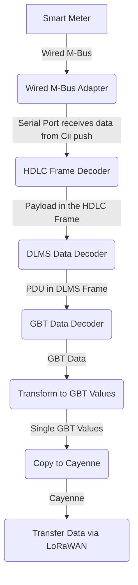

# SmartMeter CII Push M-Bus Reader
Smart meter CII push reader for RAK WisBlock IO wired M-Bus adapter 


## Smart Meter CII Reader and LoRaWAN Transmitter Overview
This repository contains open-source software for interfacing with a smart meter using the CII push protocol over a wired M-BUS adapter. The software decodes the smart meter data and transmits it using a RAK WisBlock LoRaWAN module to a designated endpoint for further processing. The software is written in C++ and is compatible with the RAK WisBlock RAK4631. Future updates aim to expand compatibility to include other MCU platforms with WLAN capabilities.

## Features
- Compatible with smart meters using the CII push protocol. Developed and testet with L&G E450
- Uses RAK WisBlock LoRaWAN modules for reliable and long-range data transmission.
- Expandable for other microcontroller units (MCUs) with WLAN support.
- Open to the Community-driven development and support.

## Hardware Requirements
- [RAKwireless WisBlock RAK4631 Core Module](https://docs.rakwireless.com/Product-Categories/WisBlock/RAK4631/Overview)
- [Wired M-BUS adapter (make it yourself)](https://github.com/MFA-Informatik-AG/rak-wisblock-io-mbus) or buy it from [Wired M-BUS adapter shop](https://shop.smartspar.ch/products/wired-m-bus-adapter)
- LoRaWAN Gateway (for data transmission)

## Installation
Please clone the repository to your local machine from 

https://github.com/MFA-Informatik-AG/sm-mbus-cii-reader


## Setting Up the Development Environment

### Step 1: Install Visual Studio Code (VS Code)
PlatformIO is available as an extension for VS Code, so the first step is to install VS Code, if you haven't already.

#### Download and Install VS Code:
Visit the Visual Studio Code website. Download the appropriate version for your operating system (Windows, macOS, or Linux). Follow the installation instructions specific to your OS.

### Step 2: Install PlatformIO Extension
Once VS Code is installed, you can install the PlatformIO extension.

- Open VS Code.
- Click on the Extensions view icon on the Sidebar.
- Search for the PlatformIO IDE extension.
- Install the the PlatformIO IDE extension.

## Software Overview

### PlatformIO Environments
There are currently environments declared in the platformio.ini

- **wiscore_rak4631** for the RAK4631 board and logging enabled. Don't use this environment for production devices as it requires more power
- **wiscore_rak4631_release** for the RAK4631 board with logging disabled. Use this environment for production devices as it requires the least power
- **wiscore_rak11200** for the RAK11200 board, currently not implementen
- **testnative** some unit tests which can be executed in a PlatformIO Terminal window with *pio test -e testnative -v*

### Project structure

|Folder         | Content                                                   |
|--             | --                                                        |
|lib\at         | AT command extension specific for Smart Meter             |
|lib\config     | Struct which holds the application wide settings          |
|lib\dlms       | Smart Meter DMLS handler                                  |
|lib\gbt        | Smart Meter GBT handler                                   |
|lib\hdlc       | Smart Meter HDLC frame handler                            |
|lib\log        | Log helper                                                |
|lib\lora       | Cayenne extension for the Smart Meter data                |
|lib\settings   | Persist application wide settings to flash                |
|lib\smartmeter | L&G E450 specific processing of Cii push data             |
|lib\wmb        | Controller and specific MCU class                         |
|src\main       | Holds all together                                        |


### PlatformIO
The build can be controlled by defines in the platformio.ini settings
**`API_DEBUG`** controls debug output of the WisBlock API

    0 -> No debug output
    1 -> WisBlock API debug output

**`MY_DEBUG`** controls debug output of the application itself

    0 -> No debug output
    1 -> WMB Adapter Application debug output

**`MY_BLE_DEBUG`** controls debug output to Bluetooth

    0 -> No debug output
    1 -> Sends debug messages also to Bluetooth

**`NO_BLE_LED`** controls the usage of the blue BLE LED.    

    0 -> the blue LED will be used to indicate BLE status
    1 -> the blue LED will not used

Example for no debug output and no blue LED
```ini
build_flags = 
	-DAPI_DEBUG=0    ; 0 Disable WisBlock API debug output
	-DMY_DEBUG=0     ; 0 Disable application debug output
	-DNO_BLE_LED=1   ; 1 Disable blue LED as BLE notificator
```
## Sample Usage


---


---


## Contributing
We welcome contributions from anyone willing to help. This document outlines the guidelines for contributing to this project. By following these guidelines, you help to create a collaborative and inclusive environment where everyone can participate effectively.

There are many ways to contribute to this project:

- **Reporting Bugs:** If you find a bug, please create an issue in our issue tracker. Be as detailed as possible in your description and include steps to reproduce the bug and mention the environment in which you encountered it.

- **Suggesting Enhancements:** We love to hear ideas for how to make our project better. Feel free to submit enhancement suggestions through the issue tracker.

- **Code Contributions:** If you want to contribute code, please follow the process outlined below.

### Code Contributions

- **Check Existing Issues:** Before starting to code, check our issue tracker for existing issues or discussions that match your idea or problem.

- **Create a New Issue:** If there is no existing issue, create one. Describe your proposed changes, the problem they solve, or the feature they add.

- **Fork the Repository:** Fork the project repository to your own GitHub account. This is where you’ll do your work.

- **Create a Branch:** In your fork, create a new branch for your work. The branch name should be descriptive, e.g., fix-memory-leak or feature-json-export.

- **Write Code:** Write your code according to the project's coding standards and best practices for C++ development. Ensure your code is well-documented. If possible include tests as well. Please ensure your code follows the project coding style and standards.

- **Commit Your Changes:** Make concise and clear commit messages. They should explain the reason for the change and any relevant details.

- **Create a Pull Request (PR):** Push your branch to your GitHub fork and open a pull request to the main project. In the pull request description, reference the issue it addresses.

- **Code Review and Merge:** Wait for code review and respond to comments and suggestions from the project maintainers. If required, make changes based on the feedback and repeat the review process. Once your pull request is approved, a project maintainer will merge it into the main codebase.


## License
This project is licensed under the MIT License - see the LICENSE file for details.

## Acknowledgments
Many thanks to RAK Wireless for WisBlock and especially Bernd Giesecke for his [WisBlock API](https://github.com/beegee-tokyo/WisBlock-API-V2)

## Changelog